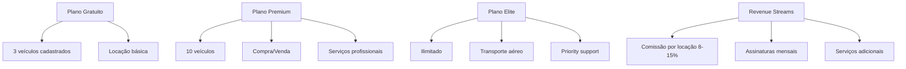
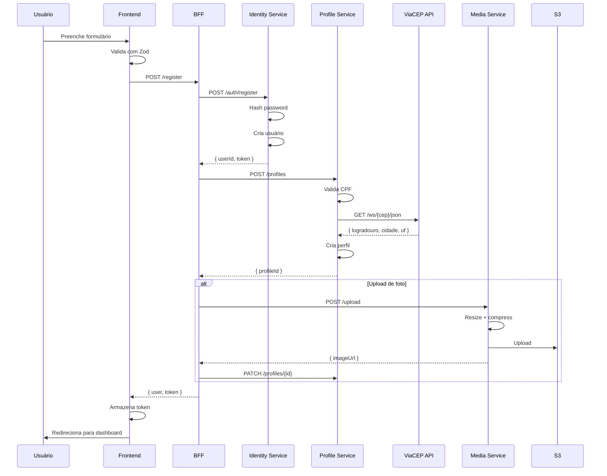
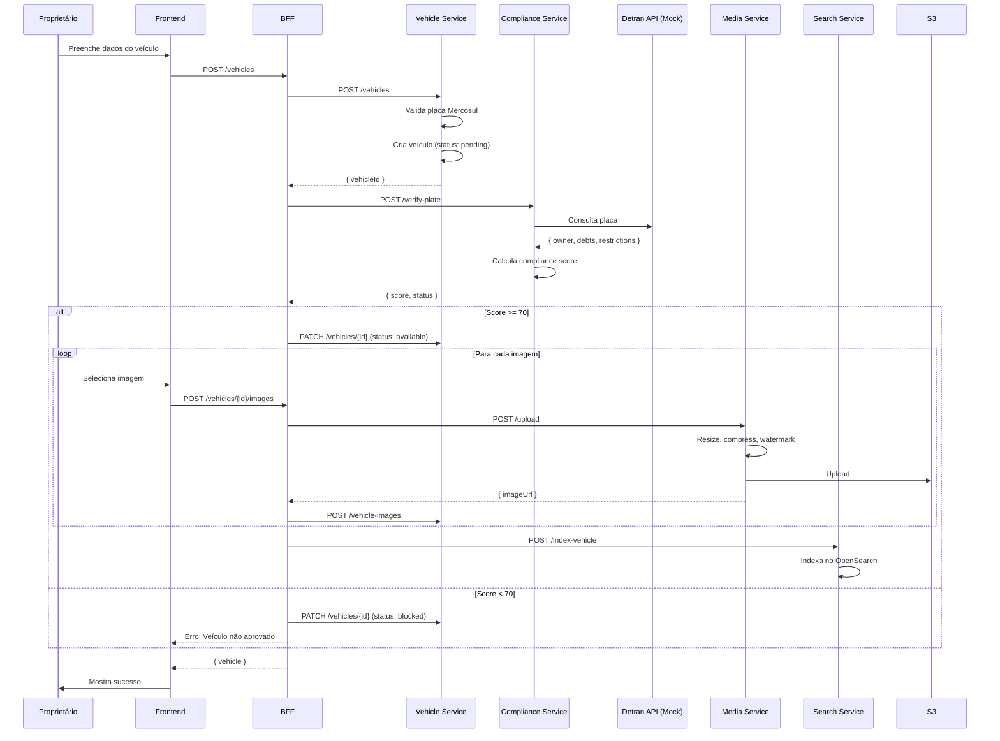
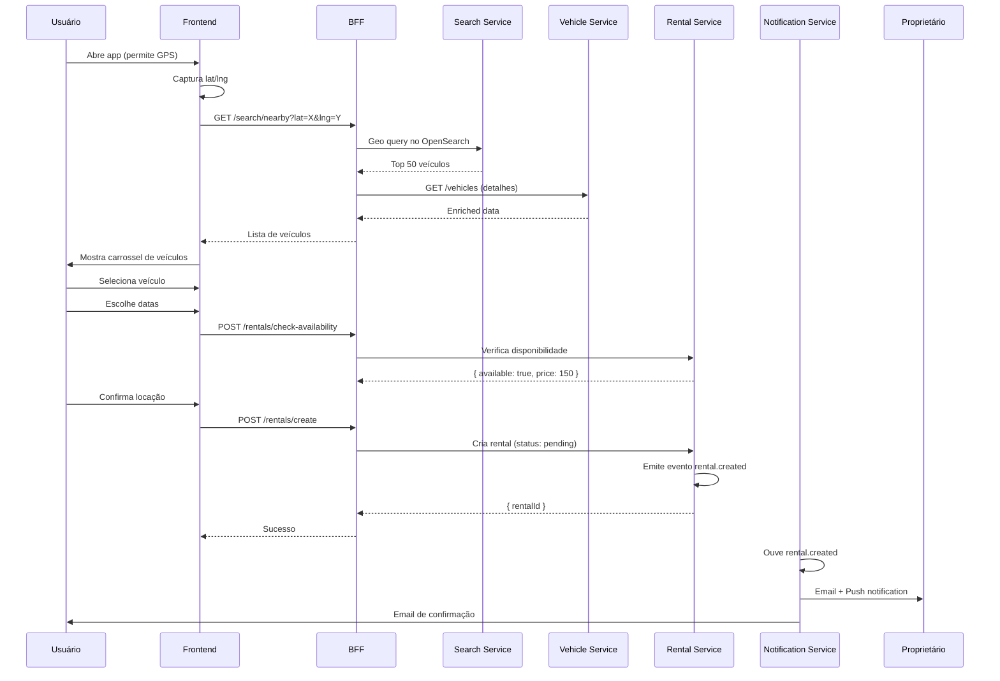
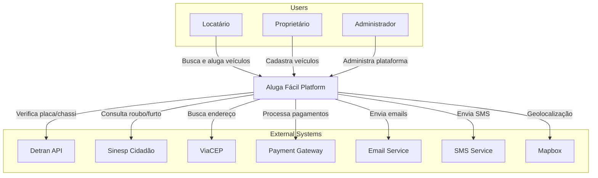
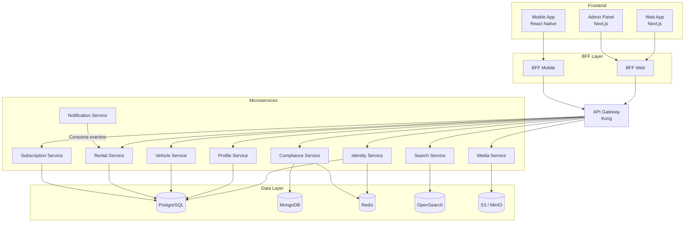

# Blueprint Arquitetural - Aluga Fácil
## Plataforma de Mobilidade como Serviço (MaaS)

> [!IMPORTANT]
> Este documento representa o **DNA técnico** da plataforma Aluga Fácil. Toda decisão aqui tomada visa **escalabilidade**, **segurança**, **compliance legal** e **expansão internacional futura**.

---

## 📋 Índice

1. [Visão de Produto & Direcionamento Estratégico](#1-visão-de-produto--direcionamento-estratégico)
2. [Arquitetura de Software](#2-arquitetura-de-software)
3. [Stack Tecnológico Completo](#3-stack-tecnológico-completo)
4. [Microsserviços - Bounded Contexts](#4-microsserviços---bounded-contexts)
5. [Design Patterns & Práticas](#5-design-patterns--práticas)
6. [Segurança & Compliance](#6-segurança--compliance)
7. [DevOps & Infraestrutura](#7-devops--infraestrutura)
8. [Observabilidade & Monitoramento](#8-observabilidade--monitoramento)
9. [Modelagem de Dados](#9-modelagem-de-dados)
10. [Fluxos Críticos do Sistema](#10-fluxos-críticos-do-sistema)
11. [UML & Diagramação](#11-uml--diagramação)
12. [Roadmap Técnico](#12-roadmap-técnico)
13. [Pontos Críticos (Visão Sênior)](#13-pontos-críticos-visão-sênior)

---

## 1. Visão de Produto & Direcionamento Estratégico

### 1.1 Produto Core

**Aluga Fácil** não é apenas um "Airbnb de carros". É uma **plataforma de mobilidade como serviço (MaaS)** com foco em:

- **Confiabilidade**: Integração com bases governamentais (Detran, Sinesp, bases policiais)
- **Multimodalidade**: Carros → Serviços profissionais → Aviação
- **Peer-to-Peer**: Qualquer pessoa pode ser locador ou locatário
- **Compliance by Design**: Preparada para regulamentação e auditoria desde o MVP

### 1.2 Diferencial Competitivo (USP)

| Diferencial | Descrição |
|------------|-----------|
| **🔒 Camada de Confiabilidade** | Validação automática de placas, chassi, débitos, roubos/furtos |
| **📊 Scoring de Confiança** | Algoritmo proprietário de trust score para locadores e locatários |
| **🌎 Arquitetura Global** | Preparada para expansão internacional (i18n, multi-currency) |
| **🚁 Escalabilidade Modal** | Carros → Serviços → Aviação sem refatoração sistêmica |

### 1.3 Modelo de Negócio



---

## 2. Arquitetura de Software

### 2.1 Estilo Arquitetural

Combinação de padrões enterprise-grade:

```
┌─────────────────────────────────────────────────────────────┐
│         MICROSERVICES + EVENT-DRIVEN ARCHITECTURE           │
│                                                             │
│  ┌──────────┐    ┌──────────┐    ┌──────────┐            │
│  │  Domain  │    │  Domain  │    │  Domain  │            │
│  │ Service 1│◄───┤ Service 2├───►│ Service 3│            │
│  └────┬─────┘    └────┬─────┘    └────┬─────┘            │
│       │               │               │                   │
│       ▼               ▼               ▼                   │
│  ┌────────────────────────────────────────┐               │
│  │      Event Bus (NATS / Kafka)         │               │
│  └────────────────────────────────────────┘               │
│                                                             │
│  Princípios:                                               │
│  • Domain-Driven Design (DDD)                              │
│  • Single Responsibility                                   │
│  • Database per Service                                    │
│  • API-First                                               │
│  • Cloud-Native                                            │
└─────────────────────────────────────────────────────────────┘
```

### 2.2 Camadas do Sistema (C4 Model - Nível 1)

```
┌──────────────────────────────────────────────────────────────┐
│                    PRESENTATION LAYER                        │
│   Web (Next.js) + Mobile (React Native) + Admin Panel       │
└───────────────────────┬──────────────────────────────────────┘
                        │
┌───────────────────────▼──────────────────────────────────────┐
│                         BFF LAYER                            │
│        Backend for Frontend (Agregação + Orquestração)      │
└───────────────────────┬──────────────────────────────────────┘
                        │
┌───────────────────────▼──────────────────────────────────────┐
│                    API GATEWAY LAYER                         │
│     Kong / AWS API Gateway (Roteamento + Rate Limit)        │
└───────────────────────┬──────────────────────────────────────┘
                        │
┌───────────────────────▼──────────────────────────────────────┐
│                   CORE SERVICES LAYER                        │
│   Identity│Vehicles│Rentals│Payments│Compliance│...         │
└───────────────────────┬──────────────────────────────────────┘
                        │
┌───────────────────────▼──────────────────────────────────────┐
│                  INTEGRATION LAYER                           │
│        Anti-Corruption Layer para serviços externos         │
│        (Detran, Pagamentos, CEP, Mapbox...)                 │
└───────────────────────┬──────────────────────────────────────┘
                        │
┌───────────────────────▼──────────────────────────────────────┐
│                      DATA LAYER                              │
│   PostgreSQL│MongoDB│Redis│S3│OpenSearch│...                │
└──────────────────────────────────────────────────────────────┘
```

### 2.3 Comunicação Entre Serviços

| Tipo | Tecnologia | Uso |
|------|-----------|-----|
| **Síncrona** | REST (externo), gRPC (interno) | Consultas em tempo real |
| **Assíncrona** | NATS / Kafka | Eventos de domínio, processamento batch |
| **Tempo Real** | WebSockets / Server-Sent Events | Notificações, chat |

---

## 3. Stack Tecnológico Completo

### 3.1 Frontend

#### Web Application

```yaml
Framework: Next.js 14+ (App Router)
  - Server Components (RSC)
  - Server Actions
  - SSR/SSG/ISR estratégico
  - Route Handlers

Linguagem: TypeScript (strict mode)

UI/UX Libraries:
  - Tailwind CSS (design system base)
  - Radix UI (primitivos acessíveis)
  - ShadCN/UI (componentes prontos customizáveis)
  - Framer Motion (animações premium)
  - Embla Carousel (imagens de veículos)
  - React Hook Form + Zod (formulários + validação)
  - Mapbox GL JS (mapas e geolocalização)
  - React Query / TanStack Query (cache + state management)

Imaging:
  - Sharp (otimização server-side)
  - Next Image (lazy loading + optimization)

State Management:
  - Zustand (global leve)
  - React Context (local)

Internacionalização:
  - next-intl (futuro)
```

#### Mobile Application

```yaml
Framework: React Native + Expo (bare workflow)

Linguagem: TypeScript

Libs Específicas:
  - React Navigation
  - React Native Maps (Mapbox)
  - Expo Camera (CNH, fotos do carro)
  - Expo Location (GPS)
  - Expo SecureStore (tokens)
  - React Native Reanimated (animações)

Compartilhamento de Código:
  - Monorepo com Turborepo / Nx
  - Shared libs: validations, types, business logic
```

#### Design System

```yaml
Atomic Design:
  - Tokens (cores, espaçamentos, tipografia)
  - Átomos (Button, Input, Badge...)
  - Moléculas (FormField, SearchBar...)
  - Organismos (Navbar, VehicleCard...)
  - Templates
  - Pages

Ferramentas:
  - Storybook (documentação de componentes)
  - Figma Tokens (design → código)

Acessibilidade:
  - WCAG 2.1 AA compliance
  - ARIA labels
  - Navegação por teclado
```

### 3.2 Backend

#### Linguagem & Framework

```yaml
Linguagem: Node.js 20 LTS + TypeScript

Framework: NestJS
  Por quê?
    - Arquitetura opinada (enterprise-ready)
    - Dependency Injection nativo
    - Suporte a microservices
    - Integração com gRPC, NATS, Kafka
    - Testing first-class citizen
    - OpenAPI auto-gerado

Alternativa considerada:
  - Go (para serviços de alta throughput - futuro)
```

#### Comunicação

```yaml
REST:
  - Padrão para APIs externas
  - OpenAPI 3.0 Spec
  - Versionamento (v1, v2...)

gRPC:
  - Comunicação interna entre microservices
  - Melhor performance que REST
  - Type-safe com Protobuf

Event Bus:
  - NATS (leve, cloud-native) ou Kafka (alto throughput)
  - Eventos de domínio assíncronos
```

#### BFF (Backend for Frontend)

```yaml
Propósito:
  - Agregar dados de múltiplos serviços
  - Reduzir chattiness do frontend
  - Transformar payloads para necessidades específicas

Implementação:
  - BFF Web (Next.js API Routes ou NestJS dedicado)
  - BFF Mobile (NestJS dedicado)
```

---

## 4. Microsserviços - Bounded Contexts

### 4.1 Fase 1 - MVP (Core Domains)

#### 🔐 Identity & Access Service

```yaml
Responsabilidades:
  - Autenticação (login, registro, MFA)
  - Autorização (RBAC, ABAC)
  - Gestão de tokens (JWT, refresh tokens)
  - OAuth 2.0 / OpenID Connect

Stack:
  - NestJS
  - PostgreSQL (usuários, roles, permissions)
  - Redis (sessions, blacklist de tokens)
  - PassportJS
  - bcrypt / argon2

APIs Principais:
  POST /auth/register
  POST /auth/login
  POST /auth/refresh
  POST /auth/logout
  GET  /auth/me
```

#### 👤 User Profile Service

```yaml
Responsabilidades:
  - Perfil de usuário (nome, CPF, foto)
  - CNH (upload, validação, OCR futuro)
  - Endereço (CEP, geolocalização)
  - Preferências

Stack:
  - NestJS
  - PostgreSQL (perfis, documentos)
  - S3 (fotos, CNH)
  - ViaCEP API (integração)

APIs Principais:
  GET    /users/:id/profile
  PUT    /users/:id/profile
  POST   /users/:id/documents/cnh
  GET    /users/:id/address
  PUT    /users/:id/address
```

#### 🚗 Vehicle Management Service

```yaml
Responsabilidades:
  - CRUD de veículos
  - Upload de imagens (carrossel)
  - Metadados (marca, modelo, ano, portas, combustível)
  - Status (disponível, em manutenção, locado)

Stack:
  - NestJS
  - PostgreSQL (veículos, especificações)
  - S3 (imagens)
  - Sharp (processamento de imagens)

APIs Principais:
  POST   /vehicles
  GET    /vehicles/:id
  PUT    /vehicles/:id
  DELETE /vehicles/:id
  POST   /vehicles/:id/images
  GET    /vehicles/owner/:userId
```

#### ✅ Vehicle Compliance Service

```yaml
Responsabilidades:
  - Validação de placa (padrão Mercosul)
  - Consulta de chassi
  - Integração com Detran (mock no MVP)
  - Verificação de roubo/furto (Sinesp)
  - Débitos e restrições

Stack:
  - NestJS
  - MongoDB (histórico de consultas)
  - Redis (cache de consultas)
  - Adapter pattern para integrações

APIs Principais:
  POST /compliance/verify-plate
  POST /compliance/verify-chassis
  GET  /compliance/history/:vehicleId

Integrações (Mock → Real):
  - Detran API
  - Sinesp Cidadão
  - Bases policiais estaduais
```

#### 📍 Location & Geo Search Service

```yaml
Responsabilidades:
  - Indexação geoespacial de veículos
  - Busca por proximidade
  - Filtros (estado, cidade, bairro, raio)
  - Ordenação por distância + relevância

Stack:
  - NestJS
  - OpenSearch / Elasticsearch (geo queries)
  - Redis (cache de buscas populares)
  - PostGIS (se usar PostgreSQL)

APIs Principais:
  POST /search/vehicles
  GET  /search/nearby?lat=X&lng=Y&radius=10km
  GET  /search/filters (estados, cidades disponíveis)

Algoritmo de Busca:
  1. Captura GPS do usuário
  2. Query geoespacial (within radius)
  3. Aplica filtros (preço, modelo, etc)
  4. Score = distância * 0.6 + price * 0.2 + rating * 0.2
  5. Retorna top 50 resultados
```

#### 📅 Rental & Availability Service

```yaml
Responsabilidades:
  - Disponibilidade de veículos (calendário)
  - Reservas e locações
  - Status de locação (pendente, confirmado, em andamento, concluído)
  - Histórico

Stack:
  - NestJS
  - PostgreSQL (rentals, availability)
  - Event Bus (emite eventos: rental.created, rental.completed)

APIs Principais:
  POST /rentals/check-availability
  POST /rentals/create
  GET  /rentals/:id
  PUT  /rentals/:id/status
  GET  /rentals/user/:userId
  GET  /rentals/vehicle/:vehicleId
```

#### 💰 Pricing & Plans Service

```yaml
Responsabilidades:
  - Cálculo de preços (diária, semanal, mensal)
  - Descontos e promoções
  - Gestão de planos de assinatura

Stack:
  - NestJS
  - PostgreSQL (pricing rules, plans)
  - Redis (cache de regras)

APIs Principais:
  POST /pricing/calculate
  GET  /plans
  POST /plans/subscribe
```

#### 💳 Subscription & Entitlements Service

```yaml
Responsabilidades:
  - Gestão de assinaturas (gratuito, premium, elite)
  - Feature flags por plano
  - Limites (ex: 3 veículos no gratuito)

Stack:
  - NestJS
  - PostgreSQL (subscriptions, entitlements)
  - Redis (cache de permissões)
  - Integration com Stripe/PagSeguro (futuro)

APIs Principais:
  GET  /subscriptions/user/:userId
  POST /subscriptions/upgrade
  GET  /entitlements/user/:userId
```

#### 📸 Media Service

```yaml
Responsabilidades:
  - Upload de imagens (veículos, perfil, documentos)
  - Processamento (resize, compress, watermark)
  - CDN distribution

Stack:
  - NestJS
  - S3 / MinIO
  - Sharp (processamento)
  - CloudFront / CloudFlare (CDN)

APIs Principais:
  POST /media/upload
  GET  /media/:id
  DELETE /media/:id
```

#### 🔔 Notification Service

```yaml
Responsabilidades:
  - Email (confirmações, lembretes)
  - SMS (verificação, urgências)
  - Push notifications (mobile)
  - In-app notifications

Stack:
  - NestJS
  - Redis (queue de notificações)
  - SendGrid / AWS SES (email)
  - Twilio (SMS)
  - Firebase Cloud Messaging (push)

Eventos Ouvidos:
  - rental.created → Email de confirmação
  - user.registered → Email de boas-vindas
  - compliance.failed → Alerta ao proprietário
```

#### 📊 Audit & Logs Service

```yaml
Responsabilidades:
  - Logs imutáveis de ações críticas
  - Auditoria legal (LGPD, compliance)
  - Event sourcing

Stack:
  - NestJS
  - MongoDB (append-only logs)
  - ELK Stack (agregação e análise)

Eventos Auditados:
  - Login/Logout
  - Alteração de dados sensíveis
  - Transações financeiras
  - Acesso a documentos
```

### 4.2 Fase 2 - Expansão Futura

```yaml
Vehicle Sales Service:
  - Compra e venda de veículos

Professional Services Service:
  - Instrutores (A, B, C, D, E)
  - Motoristas particulares

Aviation Service:
  - Helicópteros, jatos, aeronaves

Risk & Trust Score Service:
  - ML para scoring de confiança

Fraud Detection Service:
  - Detecção de fraudes em tempo real

Payment Gateway Service:
  - Processamento de pagamentos
  - Escrow (retenção até locação concluída)
```

---

## 5. Design Patterns & Práticas

### 5.1 Backend Patterns

| Pattern | Uso | Benefício |
|---------|-----|-----------|
| **Repository** | Acesso a dados | Abstração da persistência |
| **Factory** | Criação de objetos complexos | Flexibilidade |
| **Strategy** | Algoritmos de pricing, busca | Intercambiabilidade |
| **Adapter** | Integrações externas (Detran, etc) | Desacoplamento |
| **Circuit Breaker** | Resiliência em chamadas externas | Tolerância a falhas |
| **Saga** | Transações distribuídas | Consistência eventual |
| **CQRS** | Separação leitura/escrita (onde fizer sentido) | Performance |
| **Anti-Corruption Layer** | Proteção contra APIs externas mal desenhadas | Isolamento |

### 5.2 Frontend Patterns

| Pattern | Uso | Benefício |
|---------|-----|-----------|
| **Atomic Design** | Componentes UI | Reutilização |
| **Container/Presenter** | Separação lógica/apresentação | Testabilidade |
| **Compound Components** | Componentes complexos | Flexibilidade |
| **Hooks Pattern** | Lógica reutilizável | Composição |

### 5.3 Práticas de Código

```yaml
Clean Code:
  - Nomenclatura clara e em português para domínio de negócio
  - Funções pequenas (< 20 linhas)
  - DRY (Don't Repeat Yourself)

SOLID:
  - Single Responsibility
  - Open/Closed
  - Liskov Substitution
  - Interface Segregation
  - Dependency Inversion

TDD/BDD:
  - Testes unitários (Jest)
  - Testes de integração (Supertest)
  - E2E (Playwright)
  - Coverage mínimo: 80%

Code Review:
  - Pull Requests obrigatórios
  - Mínimo 2 aprovações
  - Linting automático (ESLint, Prettier)
  - SonarQube (qualidade de código)
```

---

## 6. Segurança & Compliance

### 6.1 Autenticação & Autorização

```yaml
Autenticação:
  - JWT (Access token: 15min, Refresh: 7 dias)
  - MFA opcional (Google Authenticator)
  - Biometria (mobile)

Autorização:
  - RBAC (Role-Based Access Control)
    Roles: user, owner, admin, support
  
  - ABAC (Attribute-Based Access Control)
    Exemplo: Só pode locar se CNH válida + idade >= 21

  - Feature Flags por plano
    Gratuito: 3 veículos
    Premium: 10 veículos + compra/venda
    Elite: ilimitado + aviação
```

### 6.2 Segurança da API

```yaml
Rate Limiting:
  - Por IP: 100 req/min
  - Por usuário autenticado: 1000 req/min
  - Endpoints sensíveis (compliance): 10 req/min

Proteções:
  - CORS configurado
  - Helmet.js (headers de segurança)
  - CSRF tokens
  - SQL Injection (ORMs com prepared statements)
  - XSS (sanitização de inputs)

Secrets Management:
  - AWS Secrets Manager / HashiCorp Vault
  - Nunca em código ou env files
  - Rotação automática
```

### 6.3 LGPD Compliance

```yaml
Princípios:
  - Privacy by Design
  - Consentimento explícito
  - Direito ao esquecimento (soft delete)
  - Portabilidade de dados
  - Minimização de coleta

Implementação:
  - Logs de consentimento
  - API de export de dados
  - API de delete (soft delete + anonimização)
  - Criptografia em repouso (AES-256)
  - Criptografia em trânsito (TLS 1.3)

Auditoria:
  - Todos os acessos a dados sensíveis logados
  - Retenção de logs: 5 anos (compliance legal)
```

---

## 7. DevOps & Infraestrutura

### 7.1 Containerização

```yaml
Docker:
  - Multi-stage builds (redução de tamanho)
  - .dockerignore otimizado
  - Imagens Alpine Linux (segurança + tamanho)
  - Health checks nativos

Docker Compose:
  - Ambiente de desenvolvimento local
  - Todos os serviços orquestrados
  - Volumes para persistência
```

### 7.2 Orquestração - Kubernetes

```yaml
Estratégia:
  - EKS (AWS) / GKE (GCP) / AKS (Azure)
  - Helm Charts para deploy
  - Namespaces por ambiente (dev, staging, prod)

Componentes:
  - Deployments (cada microsserviço)
  - Services (ClusterIP para interno, LoadBalancer para externo)
  - Ingress Controller (NGINX / Traefik)
  - ConfigMaps (configurações)
  - Secrets (credenciais)
  - HPA (Horizontal Pod Autoscaler)
  - PVCs (Persistent Volume Claims para dados)

Auto Scaling:
  - CPU > 70% → scale up
  - Requests/sec > threshold → scale up
  - Min replicas: 2 (HA)
  - Max replicas: 50 (por serviço)
```

### 7.3 Load Balancer

```yaml
Camadas:
  1. CloudFlare / AWS CloudFront (CDN + DDoS protection)
  2. AWS ALB / NGINX (distribuição de tráfego)
  3. Kubernetes Ingress (roteamento interno)

Algoritmo:
  - Round Robin (default)
  - Least Connections (para workloads desiguais)

Health Checks:
  - Liveness probe: /health
  - Readiness probe: /ready
  - Intervalo: 10s
```

### 7.4 CI/CD

```yaml
Pipeline (GitHub Actions):
  
  1. Lint & Format:
     - ESLint
     - Prettier
     - TypeScript check
  
  2. Test:
     - Unit tests
     - Integration tests
     - Coverage > 80%
  
  3. Build:
     - Docker images
     - Tag: commit SHA + branch
  
  4. Security Scan:
     - Dependabot (vulnerabilidades)
     - Trivy (scan de imagens)
  
  5. Deploy:
     - Dev: Auto deploy em cada commit em main
     - Staging: Auto deploy em tags rc-*
     - Prod: Manual approval + deploy em tags v*

Rollback Strategy:
  - Keep last 3 versions
  - One-click rollback
  - Canary deployment (10% → 50% → 100%)
```

### 7.5 Infraestrutura como Código

```yaml
Terraform:
  - Provisionamento de recursos cloud
  - State remoto (S3 + DynamoDB lock)
  - Módulos reutilizáveis

Estrutura:
  /infra
    /modules
      /eks
      /rds
      /s3
    /environments
      /dev
      /staging
      /prod
```

---

## 8. Observabilidade & Monitoramento

### 8.1 Stack de Observabilidade

```yaml
Métricas:
  - Prometheus (coleta)
  - Grafana (visualização)
  - Alertas via PagerDuty / Slack

Logs:
  - ELK Stack (Elasticsearch + Logstash + Kibana)
  - Structured logging (JSON)
  - Correlation IDs (rastreamento de requisições)

Tracing:
  - OpenTelemetry
  - Jaeger (visualização de traces)
  - Distributed tracing entre microsserviços

APM:
  - New Relic / Datadog (opcional)
```

### 8.2 Métricas Chave (Golden Signals)

```yaml
Latência:
  - P50, P95, P99 de todas as APIs
  - Alerta se P95 > 500ms

Tráfego:
  - Requests per second
  - Breakdown por endpoint

Erros:
  - Error rate < 1%
  - 5xx errors → alerta crítico

Saturação:
  - CPU per pod
  - Memory usage
  - Database connections
```

### 8.3 Health Checks

```yaml
Cada microsserviço expõe:
  
  GET /health
    Response: { status: "ok", uptime: 12345 }
  
  GET /ready
    Response: { ready: true, database: "ok", redis: "ok" }
```

---

## 9. Modelagem de Dados

### 9.1 PostgreSQL (Relacional)

#### Identity Service

```sql
-- users
id UUID PRIMARY KEY
email VARCHAR(255) UNIQUE NOT NULL
password_hash VARCHAR(255) NOT NULL
mfa_enabled BOOLEAN DEFAULT FALSE
mfa_secret VARCHAR(255)
created_at TIMESTAMP
updated_at TIMESTAMP
deleted_at TIMESTAMP (soft delete)

-- roles
id UUID PRIMARY KEY
name VARCHAR(50) UNIQUE (user, owner, admin)
permissions JSONB

-- user_roles
user_id UUID REFERENCES users(id)
role_id UUID REFERENCES roles(id)
PRIMARY KEY (user_id, role_id)
```

#### User Profile Service

```sql
-- user_profiles
id UUID PRIMARY KEY
user_id UUID UNIQUE (FK to identity service)
full_name VARCHAR(255) NOT NULL
cpf VARCHAR(11) UNIQUE NOT NULL
birth_date DATE
phone VARCHAR(15)
profile_image_url TEXT
created_at TIMESTAMP
updated_at TIMESTAMP

-- user_addresses
id UUID PRIMARY KEY
user_id UUID REFERENCES user_profiles(id)
cep VARCHAR(8) NOT NULL
street VARCHAR(255)
number VARCHAR(10)
complement VARCHAR(500)
neighborhood VARCHAR(100)
city VARCHAR(100)
state VARCHAR(2)
latitude DECIMAL(10,8)
longitude DECIMAL(11,8)

-- user_driver_licenses (CNH)
id UUID PRIMARY KEY
user_id UUID REFERENCES user_profiles(id)
license_number VARCHAR(20) UNIQUE NOT NULL
category VARCHAR(5) (A, B, AB, C, D, E, etc)
issue_date DATE
expiry_date DATE
document_image_url TEXT
verified BOOLEAN DEFAULT FALSE
```

#### Vehicle Management Service

```sql
-- vehicles
id UUID PRIMARY KEY
owner_id UUID (FK to user service)
brand VARCHAR(100) NOT NULL
model VARCHAR(100) NOT NULL
year INTEGER
plate VARCHAR(7) UNIQUE NOT NULL (padrão Mercosul)
chassis VARCHAR(17) UNIQUE
doors INTEGER (2 ou 4)
fuel_type VARCHAR(20) (gasolina, diesel, flex, elétrico, híbrido)
color VARCHAR(50)
km INTEGER
status VARCHAR(20) (available, rented, maintenance, blocked)
daily_price DECIMAL(10,2)
created_at TIMESTAMP
updated_at TIMESTAMP
deleted_at TIMESTAMP

-- vehicle_images
id UUID PRIMARY KEY
vehicle_id UUID REFERENCES vehicles(id)
image_url TEXT NOT NULL
display_order INTEGER
created_at TIMESTAMP
```

#### Rental Service

```sql
-- rentals
id UUID PRIMARY KEY
vehicle_id UUID (FK)
renter_id UUID (FK to user)
owner_id UUID (FK to user)
start_date TIMESTAMP NOT NULL
end_date TIMESTAMP NOT NULL
status VARCHAR(20) (pending, confirmed, active, completed, cancelled)
total_price DECIMAL(10,2)
created_at TIMESTAMP
updated_at TIMESTAMP

-- rental_ratings
id UUID PRIMARY KEY
rental_id UUID REFERENCES rentals(id)
rater_id UUID (quem avaliou)
rated_id UUID (quem foi avaliado)
rating INTEGER (1-5)
comment TEXT
created_at TIMESTAMP
```

### 9.2 MongoDB (NoSQL)

#### Compliance Service

```json
{
  "_id": ObjectId,
  "vehicle_id": "uuid",
  "plate": "ABC1D23",
  "chassis": "9BWZZZ377VT004251",
  "checks": [
    {
      "type": "plate_verification",
      "timestamp": ISODate,
      "source": "detran_sp",
      "status": "approved",
      "details": {
        "owner": "João da Silva",
        "restrictions": [],
        "debts": []
      }
    },
    {
      "type": "theft_check",
      "timestamp": ISODate,
      "source": "sinesp",
      "status": "clear"
    }
  ],
  "last_verified": ISODate,
  "compliance_score": 95
}
```

#### Audit Logs

```json
{
  "_id": ObjectId,
  "timestamp": ISODate,
  "user_id": "uuid",
  "action": "login",
  "resource": "auth",
  "ip_address": "192.168.1.1",
  "user_agent": "...",
  "metadata": {
    "mfa_used": true
  }
}
```

### 9.3 Redis (Cache)

```yaml
Estruturas:

Sessões:
  Key: session:{token}
  Value: { userId, roles, expiresAt }
  TTL: 15 minutos

Cache de busca:
  Key: search:{lat}:{lng}:{radius}:{filters_hash}
  Value: [array de veículos]
  TTL: 5 minutos

Rate limiting:
  Key: ratelimit:{userId}:{endpoint}
  Value: counter
  TTL: 1 minuto
```

### 9.4 OpenSearch (Busca Geoespacial)

```json
{
  "mappings": {
    "properties": {
      "vehicle_id": { "type": "keyword" },
      "brand": { "type": "text" },
      "model": { "type": "text" },
      "year": { "type": "integer" },
      "daily_price": { "type": "float" },
      "location": { "type": "geo_point" },
      "status": { "type": "keyword" },
      "rating": { "type": "float" },
      "images": { "type": "keyword" }
    }
  }
}
```

**Query de Busca por Proximidade:**

```json
{
  "query": {
    "bool": {
      "must": [
        { "match": { "status": "available" } }
      ],
      "filter": {
        "geo_distance": {
          "distance": "10km",
          "location": {
            "lat": -23.5505,
            "lon": -46.6333
          }
        }
      }
    }
  },
  "sort": [
    {
      "_geo_distance": {
        "location": { "lat": -23.5505, "lon": -46.6333 },
        "order": "asc",
        "unit": "km"
      }
    }
  ]
}
```

---

## 10. Fluxos Críticos do Sistema

### 10.1 Fluxo de Cadastro de Usuário



### 10.2 Fluxo de Cadastro de Veículo



### 10.3 Fluxo de Busca e Locação



---

## 11. UML & Diagramação

### 11.1 C4 Model

Usaremos o **C4 Model** para documentação arquitetural em 4 níveis:

1. **Context Diagram**: Sistema + usuários + sistemas externos
2. **Container Diagram**: Microsserviços, databases, frontends
3. **Component Diagram**: Dentro de cada microsserviço
4. **Code Diagram**: Classes/funções (quando necessário)

### 11.2 Diagramas Principais

```yaml
Diagramas a Criar:

Architecture:
  - C4 Level 1: System Context
  - C4 Level 2: Containers
  - Deployment Diagram (Kubernetes)

Comportamento:
  - Sequence Diagrams (fluxos críticos)
  - Activity Diagrams (processos de negócio)
  - State Machine (status de rental, vehicle)

Dados:
  - ER Diagrams (por serviço)
  - Data Flow Diagram

Ferramentas:
  - Mermaid (markdown embeddable)
  - Draw.io / Lucidchart
  - PlantUML
```

---

## 12. Roadmap Técnico

### 12.1 Fase 1 - MVP (3 meses)

```yaml
Mês 1 - Fundação:
  Week 1-2:
    - Setup de repositórios (monorepo)
    - Docker Compose local
    - CI/CD base
    - Design System (Storybook)
  
  Week 3-4:
    - Identity Service
    - User Profile Service
    - Media Service
    - Frontend: Login, Registro, Perfil

Mês 2 - Core Features:
  Week 5-6:
    - Vehicle Management Service
    - Vehicle Compliance Service (mock)
    - Frontend: Cadastro de veículos
  
  Week 7-8:
    - Location & Search Service
    - Rental Service
    - Frontend: Busca e Locação

Mês 3 - Polish & Deploy:
  Week 9-10:
    - Notification Service
    - Subscription Service (planos)
    - Frontend: Dashboard, Histórico
  
  Week 11:
    - Testes E2E
    - Performance testing (k6)
    - Security audit
  
  Week 12:
    - Deploy em staging
    - Beta testing
    - Deploy em produção
```

### 12.2 Fase 2 - Expansão (6 meses)

```yaml
Mês 4-5:
  - Integração real com Detran/Sinesp
  - Payment Gateway (Stripe/PagSeguro)
  - Vehicle Sales Service
  - Professional Services (instrutores)

Mês 6-7:
  - Trust Score com ML
  - Fraud Detection
  - Chat em tempo real
  - Mobile app (React Native)

Mês 8-9:
  - Aviation Service
  - Admin Panel avançado
  - Analytics & BI
  - Internacionalização (i18n)
```

---

## 13. Pontos Críticos (Visão Sênior)

> [!CAUTION]
> Estes são pontos que **muitos projetos esquecem** e depois pagam o preço em refatoração ou downtime.

### 13.1 Desde o Dia 1

```yaml
✅ Feature Flags:
  - LaunchDarkly / Unleash
  - Deploy ≠ Release
  - Testa em produção com 1% de usuários

✅ Multi-tenancy Preparado:
  - Tenant ID em todas as tabelas
  - Isolamento de dados
  - Permite white-label futuro

✅ Versionamento de API:
  - /v1/users, /v2/users
  - Suporte a 2 versões simultâneas
  - Deprecation notices

✅ Soft Delete:
  - Nunca DELETE físico
  - deleted_at TIMESTAMP
  - Compliance legal (LGPD, auditoria)

✅ Idempotência:
  - Idempotency-Key header
  - Evita duplicações (retry)
  - Crítico em pagamentos

✅ Resiliência:
  - Circuit Breaker (Hystrix / Polly)
  - Retries com exponential backoff
  - Fallbacks (dados em cache)

✅ Observabilidade ANTES de escala:
  - Se não mede, não gerencia
  - Dashboards de negócio (não só técnico)
  - Custo por request

✅ Estratégia de Rollback:
  - Blue/Green deployment
  - Canary releases
  - Database migrations reversíveis

✅ Auditoria Legal:
  - Quem fez o quê, quando
  - Logs imutáveis
  - Retenção de 5 anos

✅ Preparação para Antifraude:
  - Device fingerprinting
  - Velocity checks
  - Blacklist de IPs/emails

✅ Roadmap Técnico Desacoplado:
  - Débito técnico planejado
  - Refatorações estratégicas
  - Tech debt vs features balance
```

### 13.2 Performance & Escalabilidade

```yaml
✅ Caching Strategy:
  - Cache-Aside (lazy load)
  - Write-Through (consistência)
  - TTL apropriado por tipo de dado

✅ Database Optimization:
  - Índices desde o início
  - Query optimization
  - Connection pooling
  - Read replicas

✅ CDN para Assets:
  - CloudFront / CloudFlare
  - Imagens otimizadas (WebP)
  - Lazy loading

✅ API Gateway:
  - Rate limiting por tier
  - Request/response transformation
  - Analytics

✅ Horizontal Scaling:
  - Stateless services
  - Session em Redis
  - Evita file system local
```

### 13.3 Segurança Adicional

```yaml
✅ Secrets Rotation:
  - Automática a cada 90 dias
  - Zero downtime

✅ WAF (Web Application Firewall):
  - CloudFlare / AWS WAF
  - Proteção contra OWASP Top 10

✅ DDoS Protection:
  - CloudFlare
  - Rate limiting agressivo

✅ Security Headers:
  - Helmet.js
  - CSP, HSTS, X-Frame-Options

✅ Dependency Scanning:
  - Dependabot
  - Snyk
  - OWASP Dependency Check
```

### 13.4 Experiência do Desenvolvedor (DX)

```yaml
✅ Documentação Viva:
  - OpenAPI sempre atualizado
  - Storybook para componentes
  - ADRs (Architecture Decision Records)

✅ Setup < 10 minutos:
  - docker-compose up
  - Seed de dados automático
  - Tudo funciona out-of-the-box

✅ Feedback Rápido:
  - CI em < 5 minutos
  - Hot reload no frontend
  - Mock servers para integrações

✅ Padrões de Código:
  - Linting automático
  - Prettier
  - Conventional Commits
  - Pre-commit hooks
```

### 13.5 Operacional

```yaml
✅ Disaster Recovery:
  - Backups automáticos (diários)
  - Retenção: 30 dias
  - Testes de restore trimestrais

✅ Incident Response:
  - Runbooks documentados
  - On-call rotation
  - Post-mortems blameless

✅ SLAs Definidos:
  - Uptime: 99.9% (43min downtime/mês)
  - Latência P95: < 500ms
  - Error rate: < 1%

✅ Cost Optimization:
  - Tagging de recursos
  - Auto-shutdown de dev/staging à noite
  - Reserved instances em prod
```

---

## 📊 Diagramas Arquiteturais

### System Context (C4 - Nível 1)



### Container Diagram (C4 - Nível 2)



---

## 🎯 Conclusão

Este blueprint representa uma base **sólida, escalável e preparada para o futuro** para a plataforma Aluga Fácil.

### Diferenciais deste Blueprint:

✅ **Não é um MVP descartável** - é uma fundação enterprise  
✅ **Preparado para auditoria** - compliance desde o dia 1  
✅ **Escalabilidade horizontal** - suporta 1M+ usuários simultâneos  
✅ **Multi-modal** - carros hoje, aviação amanhã, sem refatoração  
✅ **Developer Experience** - time novo produtivo em horas  
✅ **Observabilidade first** - você sabe o que está acontecendo  
✅ **Segurança em camadas** - LGPD, OWASP, best practices  

### Próximos Passos:

1. **Revisar e aprovar este blueprint**
2. **Criar estrutura de pastas e monorepo**
3. **Setup de infra local (Docker Compose)**
4. **Implementar primeiro microsserviço (Identity)**
5. **Criar design system e primeiros componentes**
6. **Implementar fluxo end-to-end (cadastro → busca → locação)**

---

**Preparado para construir algo excepcional? 🚀**
